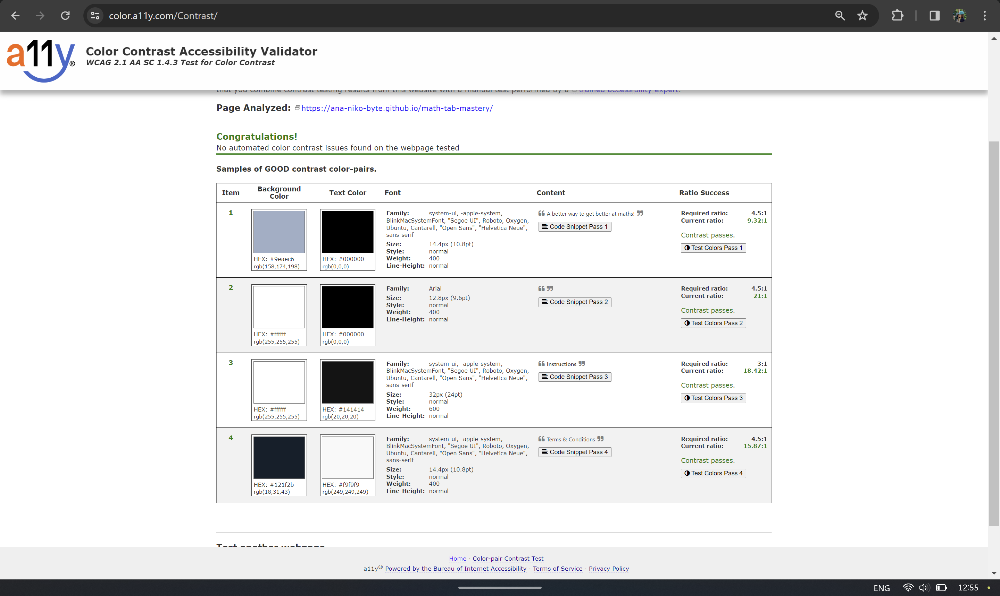
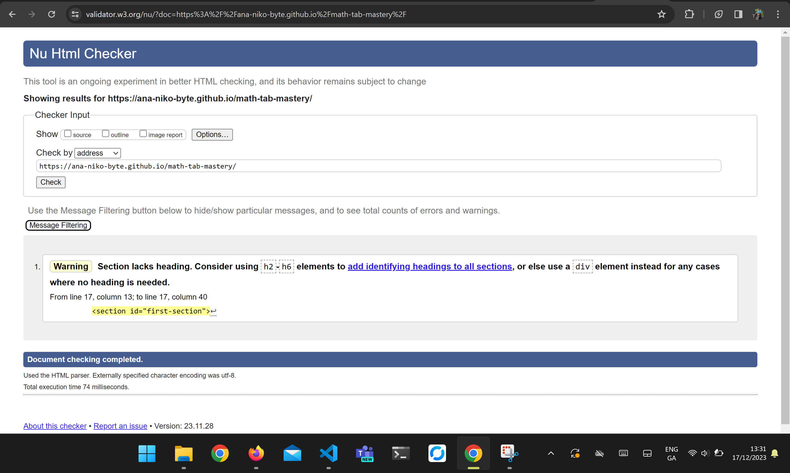

# Revise Maths
This maths game is designed as a fun and engaging way of helping young kids study and get better at mental arithmetic. This game was created purely for educational purposes. 

# Business/Social Goals
- Create a fun and engaging platform for young kids to learn arithmetic and help them develop an interest in mathematics and logical thinking. 
- Add a competitive edge to the game by using a timer for each arithmetic session - this will allow the user to either compete against peers or themselves in the amount of questions they answer correctly within 30 seconds. 
- Create an intuitive interface for young users to increase comfort with using the program, and encourage them to use it repeatedly - drive traffic onto the website. 
- Encourage the idea that games can be used as an additional tool in learning, and not as a form of distraction.
- Allow users to take their time revising any errors in their own time following each timed arithmetic session.

# UX Goals
- Create a simple and intuitive user interface for young and first time users to foster a sense of comfort and reassurance. 
- To allow the user as much control over their learning enviornments as possible and appropriate - ensure they can pick what kind of arithmetic they want (Add-Subtract, Multiplication, Division, or Random), include 'Skip' and 'Exit Game' buttons for each session in case the user becomes overwhelmed.
- Colour differentiate the wrongly answered questions in a tab system for the revision game to mark the different categories.
- Make sure the UI maintains its focus on content by excluding all unnecessary information. 
- Where colours are used, they are to be used for the purpose of highlighting or differentiating one element from another. 

# Structure 
The structure of the 'Revise Maths' game is as follows: 

## Page 1
- Intro
    - Title of game
    - Subtitle
    - Name Input field
- Arithmetic category selection 
    - Add-Subtract, 
    - Multiplication,
    - Division,
    - Random
- Footer
    - Copyright
    - Terms and Conditions
    - Socials 
        - LinkedIn
        - GitHub
        - Instagram

## Page 2
- Intro
    - Title of game
    - Time Bar
    - Score Tracking
        - right answers
        - wrong answers -> Logged as tabs to revision area. 
    - Main Game
        - User Points Tracking
        - Game area
    - Revision Game
        - Tabs with incorrect questions
- Buttons for user control 'skip' and 'submit' on each page.
- 'Exit' button for returning to home page on each page. 
- Footer (same content as _Page 1_). 

# Scope of Application

The scope of this application is as follows: 
1. This is a front end application, created to help young users with mental arithmetic and logical thinking. 
2. A heading with the name of the application and a short description on the first 'login' page. Wording is kept to the bare minimum after this to ensure attention is directed towards necessary fields only - the game field, and later the revision field. 
3. Category selection - so users can pick the type of arithmetic they would like to practice. This works as a type of difficulty selection. 
4. The game field contains a small introduction with the user's name and the task they are to solve. 
5. 'Submit' and 'Skip' buttons below the field. Additional logic is implemented to handle 'Enter' keypress instead of 'Submit'. 'Skip' skips one question. 
6. Score tracking for answered questions. 
7. A revision field for incorrectly answered questions. Tabs at the edge of this field record the incorrectly answered questions for revision later. 
8. 'Exit' button to end the session. 
9. Footer containing copyright, t&c, and links to social platforms (LinkedIn, GitHub, and Instagram). 

# Strategy
It is the goal of this application to create a dynamic, intuitive, and simple interface to help young users study, improve and speed up their mental arithmetic and logical thinking. To design the application, aspects like target audience, key information deliverables, visual simplicity, and data transfer were key considerations: 

## Target Audience
- Young users (6 - 12 yrs)

## Key Information Deliverables
- Category Selection
- Game field with relevant information
- Visual score tracking 
- Revision Field with tabs

## Visual Simplicity
- Minimise distraction by avoiding images and icons within the main fields, but use colours to engage young users and emphasise information containers and user interactions where appropriate. 
- White Space in main fields (gaming and revision) to minimise distraction of cintent around + 'clear' space for thinking + place emphasis on task inside these fields. 
- Minimum and concise wording - Clear headings, short description + greeting, recognisable, one-word buttons describing purpose (with caution of avoiding 'Quit' on the exit button to avoid negative conotation). 
- Visual score tracking system using red for wrong answers and green for correct answers + large numbers for amount of wrong/right answers recorded. 
- Recognisable tab system (often used in school folders) for recording incorrect answers for easy recognition. 

This application is intended to be used primarily on laptop, but actively considers visual appeal and usability on phones through media queries and content placement/spacing. 

# Wireframes

# Aesthetics
The UI is kept simple for the purpose of diirecting user attention to specific areas in the app. As the main maths game is time-based, the UI is designed minimal (in colour and decoration), so as to not distract the user from the game. 

Colour is added to the tabs displaying the wrongly-answered questions in the revision game field. The purpose of the colour differentiations in mostly in the add-subtract game, and in the random mix of questions. The tabs serve as a visual aid for the user to see how many questions you got wrong in what categories, and as a method of adding a bit of colour to the UI, since the revision game in not timed and users can now take their time in revising the questions. 

# Features
- First Page (login)
The first page serves as an introduction to the game. It is split into two sections, viewed from left to right. On the left, is a login for the game where the user is required to enter their name using letters only (a-zA-Z) and no spaces. This is later used in on the second page. After the name input field, the user must select the category they wish to play - Add/Subtract, Multiplication, Division, or Random. On the right is a comprehensive instructions manual for first-time users. 

- Second Page (main game)
The main game begins after the user has entered their name and selected a category to play. Their are two fields (main game and revision). The revision field is hidden and displays automatically after the user's time runs out to play the main game (30 seconds). 

The main game has several features: 
- Heading (to keep a similar pattern in the UI throughout).
- Time progress bar (for the user to be able to monitor their time). 
- Score Tracking (right and wrong answers are logged here). 
- Points system (this is mostly to add a more game-like feel to the game). This is also where the user's name (entered on the login field) is re-used. 
- Main Game field with randomly generated questions (but in keeping with the selected category). 
- Button field with 'skip', 'submit', and 'exit game'. These work as expected. 

After 30 seconds (or when the progress bar fills up as javascript as a language seems to be a little inaccurate with timing), the main game disappears and the revision field is displayed. 

The revision game also has similar features: 
- Heading
- Time progress bar (which now underlines the heading as emphasis instead of being re-used). 
- Visible Scores. 
- Tabs : These are key to the game. They hold the values of the questions the user got wrong, and display the wrong questions in order on 'Enter' or 'submit'. The user also has the option to click the tabs out of order, and it will display the relevant questions. The clicked or active tab changes its UI slightly to visually indicate which is clicked (turns a different colour and translates to a different height). 
- Tab Validation : on 'Enter' or submit, the tabs are validated for the correct answer. If answered correctly, the tab colour changes to green. If answered incorrectly, the tab is greyed out. 
- Buttons (these buttons are re-used from the main game but handle slightly different logic in the revision field).
- An alert after all tabs have been attempted to tell the user they have finished the game and to exit. 

# Technologies
The application was made possible using the following technologies:

HTML5 - Used for structuring and content.
CSS3 - Used for adding styles to the content for legibility and aesthetic appeal.
Vanilla Javascript - To add the interactivity, validation and page display toggling for the application to work.
FontAwesome - used for icons.
Firefox Developer Tools - used for debugging the website during production.
Lighthouse - An extension I used for testing the performance, accessibility, best practices and SEO of my site (result shown under debugging below).
GitHub - For code storage,version control and deployment.
Git - For commiting through terminal and pushing to Github for storage.
VSC - The IDE I developed the project in.
Balsamiq - For a clear understanding of the structure I wanted my application to follow. The project has since deviated slightly from the design for improved user experience.
Color Contrast Accessibility Validator - check legibility of my text on different backgrounds for better accessibility.
W3C Markup Validation Service - to validate my HTML for potential errors.
W3C CSS Validation Service - to validate my CSS code for potential errors.
Freeformatter CSS Beautify - to ensure I formatted my CSS correctly.
AmIResponsive - to create the responsive image.
Looka.com - for logo ideas (Ai tool).

# Testing & Debugging

# Accessibility & Performance
### Lighthouse

These are the results of the first lighthouse test. While overall, I am quite happy with them - it is worth noting that there are no images and limited icons being used on the site, thus the results above were quite easy to achieve. Accessibility, however, was a cause for concern and was addressed immediately after the first test. The second test results are shown below. 

### Colour Accessibility Validator 
The colour accessibility validator used to text the application can be found [here](https://color.a11y.com/)
.
While these results are satisfactory, it is worth noting that due to the nature of the application, the validation scope did not take into account the various layout shifts (and associated colours), as in the main game and revision fields. As such, these were validated by eye and by getting feedback from external eyes.

### HTML Validation

After running a test on [W3C Markup Validation Service](https://validator.w3.org/), there appeared to be a few warnings to address. The first of these (the favicon), was fixed by removing a '/' from the end of the link tag. 

The other warning - a lacking heading tag in the two 'section' tags was left as is as there is no need for a heading based on the game's UI. The game is given a heading using a logo image generated on looka.ai. The fields (main game and revison), change and have the relevant headings associated with them. If this was an error, instead of a warning, I would have refactored the code accordingly. As such, HTML validation was left with one warning and no errors: 

### CSS Validation

A test was ran on [W3C CSS Validation Service by Jigsaw](https://jigsaw.w3.org/css-validator/). There were no errors or warnings at the time of this report (after all functionality was implemented).

# Deployment
The application is deployed on Gitpages through github, and is available for viewing in the link at the top of this README.md document. To deploy a github repository, follow the following steps: 

1. Login to your github account
2. Click on your repository section under your profile icon, and select the repository you want to deploy.
3. Once you are in your repository, click ' Settings' in the top bar. 
4. Select 'Pages' from the menu on the left. 
5. Ensure the 'Source' section is set to 'Deploy from a branch'.
6. Ensure you deploy from the main branch in your root directory. The screen should look something like this: 

7. The site you want to deploy is given a URL, available above the source section, as in the image above. It might take a while for this link to become visible and active. 

### Forking a Github Repository

If you want to make changes to your repository (or part of it) without affecting it, you can 'fork' it (make a copy of it). This ensures the original repository remains unchanged. To fork a github repository, follow the following steps: 

1. Click into the github repository you want to fork. 
2. Click 'Fork' in the top right hand side of the top bar, and this should take you to a page titled 'Create a new fork'
3. You can now work in this copy of your repository without it affecting the original. 

### Cloning a Github Repository
Cloning a repository essentially means downloading a copy of your repository that can be worked on locally. This method allows for version control and back up of code. To clone a github repository, follow the following steps: 

1. Click into the github repository you want to clone. 
2. Press the 'Code' button. This should open a section similar to the one below. 

3. Copy the link in this dropdown
4. Open a terminal within your VSC (or whatever IDE you choose to use). 
5. In the terminal type 'git clone' and paste the URL. 
6. Press Enter - you now have a cloned version of your github repository.

# Credits
Some code was taken from CodeAcademy's lovemaths project. It is referenced in the relevant areas in the javascript file. 
The code for the progress bar was taken from W3Schools and can be found here: https://www.w3schools.com/howto/howto_js_progressbar.asp
Stack overflow was occasionally used to double-check functionalities through the entire project. 

# Acknowledgements
A big thank you to Harry Dhillon who pushed me to incorporate more functionality into the project and encouraged me when I was having a hard time with the project. 