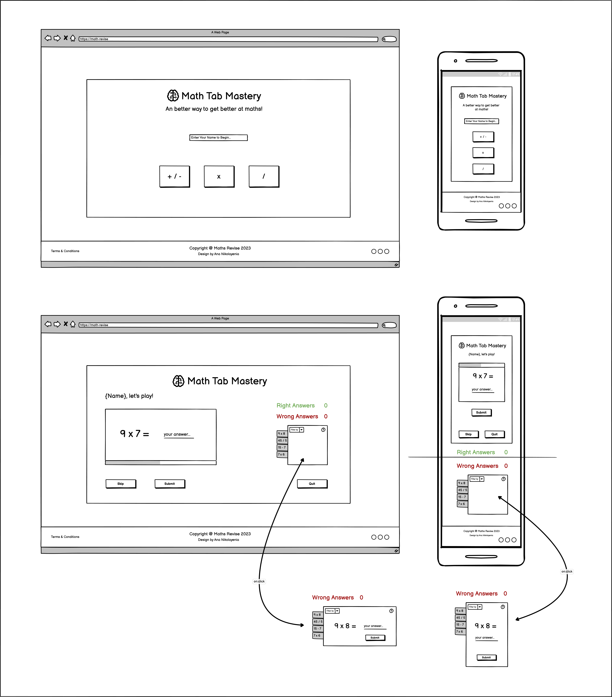
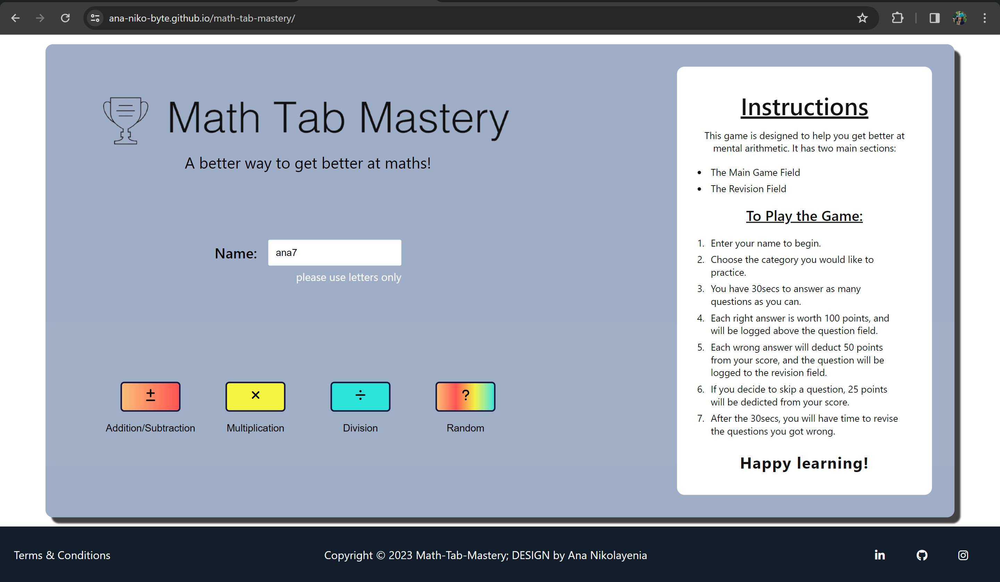
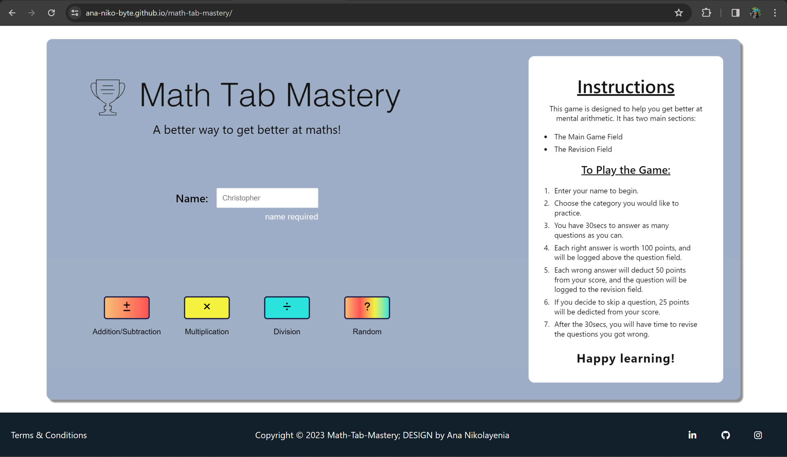
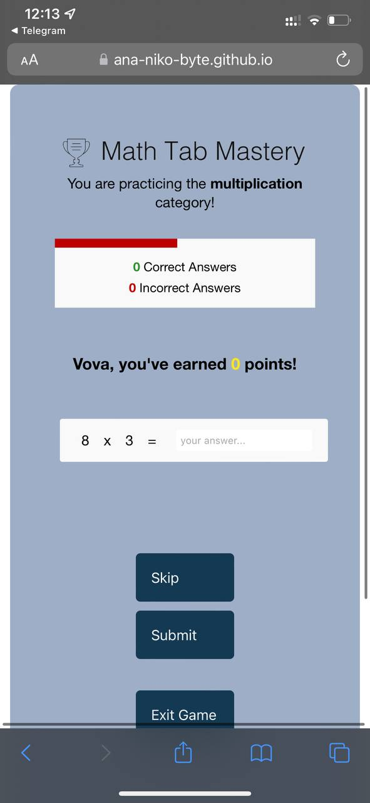
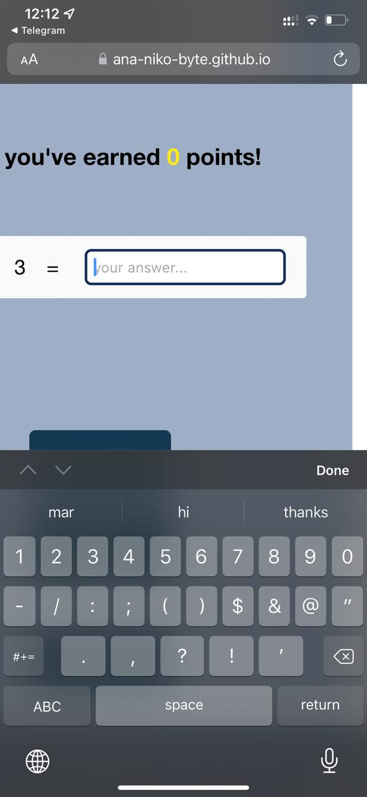
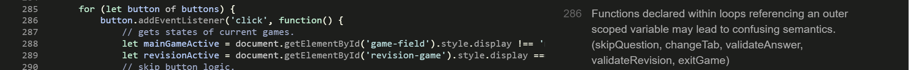

# Revise Maths
This maths game is designed as a fun and engaging way of helping young kids study and get better at mental arithmetic. This game was created purely for educational purposes. 

The application is available for viewing [here](https://ana-niko-byte.github.io/math-tab-mastery/)

# Business/Social Goals
- Create a fun and engaging platform for young kids to learn arithmetic and help them develop an interest in mathematics and logical thinking. 
- Add a competitive edge to the game by using a timer for each arithmetic session - this will allow the user to either compete against peers or themselves in the amount of questions they answer correctly within 30 seconds. 
- Create an intuitive interface for young users to increase comfort with using the program, and encourage them to use it repeatedly - drive traffic onto the website. 
- Encourage the idea that games can be used as an additional tool in learning, and not as a form of distraction.
- Allow users to take their time revising any errors in their own time following each timed arithmetic session.

# UX Goals
- Create a simple and intuitive user interface for young and first time users to foster a sense of comfort and reassurance. 
- To allow the user as much control over their learning enviornments as possible and appropriate - ensure they can pick what kind of arithmetic they want (Add-Subtract, Multiplication, Division, or Random), include 'Skip' and 'Exit Game' buttons for each session in case the user becomes overwhelmed.
- Colour differentiate the wrongly answered questions in a tab system for the revision game to mark the different categories.
- Make sure the UI maintains its focus on content by excluding all unnecessary information. 
- Where colours are used, they are to be used for the purpose of highlighting or differentiating one element from another. 

# Structure 
The structure of the 'Revise Maths' game is as follows: 

## Page 1
- Intro
    - Title of game
    - Subtitle
    - Name Input field
- Arithmetic category selection 
    - Add-Subtract, 
    - Multiplication,
    - Division,
    - Random
- Footer
    - Copyright
    - Terms and Conditions
    - Socials 
        - LinkedIn
        - GitHub
        - Instagram

## Page 2
- Intro
    - Title of game
    - Time Bar
    - Score Tracking
        - right answers
        - wrong answers -> Logged as tabs to revision area. 
    - Main Game
        - User Points Tracking
        - Game area
    - Revision Game
        - Tabs with incorrect questions
- Buttons for user control 'skip' and 'submit' on each page.
- 'Exit' button for returning to home page on each page. 
- Footer (same content as _Page 1_). 

Note: These images do not show the footer.

# Scope of Application
The scope of this application is as follows: 
1. This is a front end application, created to help young users with mental arithmetic and logical thinking. 
2. A heading with the name of the application and a short description on the first 'login' page. Wording is kept to the bare minimum after this to ensure attention is directed towards necessary fields only - the game field, and later the revision field. 
3. Category selection - so users can pick the type of arithmetic they would like to practice. This works as a type of difficulty selection. 
4. The game field contains a points system with the user's name to keep track of their scores :
    - each right answer is worth 100pts.
    - each wrong answer deducts 50pts.
    - if the user skips a question, the points will deduct by 25pts.
5. 'Submit' and 'Skip' buttons below the field. Additional logic is implemented to handle 'Enter' keypress instead of 'Submit'. 'Skip' skips one question in the main game, and moves onto the next tab in the revision game. 
6. Score tracking for answered questions. 
7. A revision field for incorrectly answered questions. Tabs at the top of this field record the incorrectly answered questions for revision later. When a user clicks on one of these tabs, the question is displayed again. If answered correctly, the tab turns green. If incorrect, an alert appears with the correct answer, and the tab turns grey.  
8. 'Exit' button to end the session. 
9. Footer containing copyright, t&c, and links to social platforms (LinkedIn, GitHub, and Instagram). 

# Strategy
It is the goal of this application to create a dynamic, intuitive, and simple interface to help young users study, improve and speed up their mental arithmetic and logical thinking. To design the application, aspects like target audience, key information deliverables, visual simplicity, and data transfer were key considerations: 

## Target Audience
- Young users (6 - 12 yrs)

## Key Information Deliverables
- Category Selection
- Game field with relevant information
- Visual score tracking 
- Revision Field with tabs

## Visual Simplicity
- Minimise distraction by avoiding images and icons within the main fields, but use colours to engage young users and emphasise information containers and user interactions where appropriate. 
- White Space in main fields (gaming and revision) to minimise distraction of cintent around + 'clear' space for thinking + place emphasis on task inside these fields. 
- Minimum and concise wording - Clear headings, short description + greeting, recognisable, one-word buttons describing purpose (with caution of avoiding 'Quit' on the exit button to avoid negative conotation). 
- Visual score tracking system using red for wrong answers and green for correct answers + large numbers for amount of wrong/right answers recorded. 
- Recognisable tab system (often used in school folders) for recording incorrect answers for easy recognition. 

This application is intended to be used primarily on laptops, but actively considers visual appeal and usability on phones through media queries and content placement/spacing. 

# Wireframes

Please note: The design has deviated from this slightly for better UX and UI. 

# Aesthetics
The UI is kept simple for the purpose of diirecting user attention to specific areas in the app. As the main maths game is time-based, the UI is designed minimal (in colour and decoration), so as to not distract the user from the game. 

Colours are organised at the top of the CSS file as such: 
:root {
    --white: rgb(249, 249, 249);
    --right-score: rgb(48, 145, 48);
    --wrong-score: rgb(189, 0, 0);
    --wrong-revision: rgb(196, 196, 196);
    --points: rgb(255, 232, 22);
    --dark-font-color: rgb(20, 20, 20);

    --addition: rgb(249, 189, 116);
    --subtract: rgb(253, 83, 83);
    --multiply: rgb(242, 242, 64);
    --division: rgb(43, 227, 218);
}

Colour is added to the category buttons:
    - add-subtract (orange to red as gradient).
    - multiplication (green).
    - division (blue).
    -random (gradient of all categories previous). 

This is designed to indicate that the random category is a mix of all the previous categories, as well as a colourful element in the game. 

Colour is also added to the tabs displaying the wrongly-answered questions in the revision game field. The purpose of the colour differentiations in mostly in the 'add-subtract' and 'random' games. The tabs serve as a visual aid for the user to see how many questions you got wrong in what categories, and as a method of adding a bit of colour to the UI. The colours allow the user to easily differentiate between the categories. For instance, from a brief glance in the image below, the user can quickly come to the conclusion that they need to work on their arithmetic in 'division'. 

# Features
- First Page (login)
The first page serves as an introduction to the game. It is split into two sections, viewed from left to right. On the left, is a login for the game where the user is required to enter their name using letters only (a-zA-Z) and no spaces. This is later used in on the second page. After the name input field, the user must select the category they wish to play - Add/Subtract, Multiplication, Division, or Random. On the right is a comprehensive instructions manual for first-time users. 

The name input fields are validated based on input. The user must use only English letters, with no spacing. The examples below demonstrate violations.

- Second Page (main game)
The main game begins after the user has entered their name and selected a category to play. Their are two fields (main game and revision). The revision field is hidden and displays automatically after the user's time runs out to play the main game (30 seconds). 

Note: These images do not show the footer.

The main game has several features: 
- Heading (to keep a similar pattern in the UI throughout).
- Time progress bar (for the user to be able to monitor their time). 
- Score Tracking (right and wrong answers are logged here). 
- Points system (this is mostly to add a more game-like feel to the game). This is also where the user's name (entered on the login field) is re-used. 
- Main Game field with randomly generated questions (but in keeping with the selected category). 
- Button field with 'skip', 'submit', and 'exit game'. These work as expected. 

After 30 seconds (or when the progress bar fills up as javascript as a language seems to be a little inaccurate with timing), the main game disappears and the revision field is displayed. 

The revision game also has similar features: 
- Heading
- Time progress bar (which now underlines the heading as emphasis instead of being re-used). 
- Visible Scores. 
- Tabs : These are key to the game. They hold the values of the questions the user got wrong, and display the wrong questions in order on 'Enter' or 'submit'. The user also has the option to click the tabs out of order, and it will display the relevant questions. The clicked or active tab changes its UI slightly to visually indicate which is clicked (turns a different colour and translates to a different height). 
- Tab Validation : on 'Enter' or submit, the tabs are validated for the correct answer. If answered correctly, the tab colour changes to green. If answered incorrectly, the tab is greyed out. 
- Buttons (these buttons are re-used from the main game but handle slightly different logic in the revision field).
- An alert after all tabs have been attempted to tell the user they have finished the game and to exit. 

# Technologies
The application was made possible using the following technologies:

1. HTML5 - Used for structuring and content.
2. CSS3 - Used for adding styles to the content for legibility and aesthetic appeal.
3. Vanilla Javascript - To add the interactivity, validation and page display toggling for the application to work.
4. FontAwesome - used for icons.
5. Firefox Developer Tools - used for debugging the website during production.
6. Lighthouse - An extension I used for testing the performance, accessibility, best practices and SEO of my site (result shown under debugging below).
7. GitHub - For code storage,version control and deployment.
8. Git - For commiting through terminal and pushing to Github for storage.
9. VSC - The IDE I developed the project in.
10. Balsamiq - For a clear understanding of the structure I wanted my application to follow. The project has since deviated slightly from the design for improved user experience.
11. Color Contrast Accessibility Validator - check legibility of my text on different backgrounds for better accessibility.
12. W3C Markup Validation Service - to validate my HTML for potential errors.
13. W3C CSS Validation Service - to validate my CSS code for potential errors.
14. JSHint - for checking and validating my JS code. 
15. Freeformatter CSS Beautify - to ensure I formatted my CSS correctly.
16. Beautifier.io - to beautify my JS. 
16. AmIResponsive - to create the responsive image.
17. Looka.com - for logo ideas (Ai tool).

# Testing & Debugging

Note: When tested on Android devices, the application works as expected. However, when tested on an iPhone 11 pro max, the application shows up with blue wording, and unexpected scaling when clicked into an input (perhaps an iPhone feature for better user comfort). Images shown below. 

An attempt was made to fix this by adding a fixed _color_ property to the buttons and _::after_ text. 

The images below show a before and after of the main game. The first image shows the application as it is meant to be displayed. The second shows what happens when the user clicks into the input field. 

As this application is intended to be used on laptop, this bug was left as is as it is inherent to iPhone users only.

### Debugging
Debugging was mainly done using a series of console.log statements when writing and calling functions, and checking for any errors logged to the console by the appliation. 

In the images below, I am logging my code to check that each variable stores the expected output, and checking the console for the relevant logs.

Testing was done using Chrome's developer tools and the built-in responsive environment (avaiable by pressing 'Ctrl' + 'M'). 

# Accessibility & Performance
### Lighthouse

These are the results of the first lighthouse test. While overall, I am quite happy with them - it is worth noting that there are no images and limited icons being used on the site, thus the results above were quite easy to achieve. Accessibility, however, was a cause for concern and was addressed immediately after the first test. The second test results are shown below. 

### Colour Accessibility Validator 
The colour accessibility validator used to text the application can be found [here](https://color.a11y.com/)

While these results are satisfactory, it is worth noting that due to the nature of the application, the validation scope did not take into account the various layout shifts (and associated colours), as in the main game and revision fields. As such, these were validated by eye and by getting feedback from external eyes.

### HTML Validation

After running a test on [W3C Markup Validation Service](https://validator.w3.org/), there appeared to be a few warnings to address. The first of these (the favicon), was fixed by removing a '/' from the end of the link tag. 

The other warning - a lacking heading tag in the two 'section' tags was left as is as there is no need for a heading based on the game's UI. The game is given a heading using a logo image generated on looka.ai. The fields (main game and revison), change and have the relevant headings associated with them. If this was an error, instead of a warning, I would have refactored the code accordingly. As such, HTML validation was left with one warning and no errors: 

### CSS Validation

A test was ran on [W3C CSS Validation Service by Jigsaw](https://jigsaw.w3.org/css-validator/). There were no errors or warnings at the time of this report (after all functionality was implemented).

### JSHint Validation
Tests on [JSHint](https://jshint.com/) were ran regularly while the project was being developed. The final report was as follows: 

As there were no errors in the final report, nothing was changed in the actual javascript file as this would require some significant reconfiguring (in the case of the first two errors). One thing to note is my userButtonActions function is quite large and could probably be broken up into two more separate functions, with each being called inside this function (as in the exitGame function). After codeInstutute, I will reconfigure the script to be more organised and maintainable. Here is an overall breakdown: 

As I now know, loops are incredibly expensive when it comes to javascript performance. While they are quite handy, I should avoid using them within functions where possible. In line 47, I am using a loop to iterate over my buttons and add a 'click' event listener so that I can get the data-type associated with each button and start the relevant game. One way to fix this would be to add 'id's to these buttons and attach event listeners to them separately. This way, the buttons would include their own functions and I wouldn't need to use loops. However, this would require more code in the script and wouldn't look as clean. 

Similarly, in line 286, I am using a loop inside a function to iterate over my user-control buttons and get the data-type associated with each button. This particular function is quite large and could probably be broken up. Same as the last loop, this can be avoided using ids and event listeners. However, for the sake of getting comfortable with loops, I decided to use this method instead, as this particular app's performance is not significantly impacted. For larger applications, I will consider using alternative methods. 

In lines 418 and 639, I am getting similar errors in my expressions due to the fact that I am using ternary expressions. I could address these warning by switching to ordinary condition checking, like an 'if' statement. However, as the application works fine the way it is with no errors in console, I have decided to leave it as is (it also saves a bit of space and lets me practice).

# Deployment
The application is deployed on Gitpages through github, and is available for viewing in the link at the top of this README.md document. To deploy a github repository, follow the following steps: 

1. Login to your github account
2. Click on your repository section under your profile icon, and select the repository you want to deploy.
3. Once you are in your repository, click ' Settings' in the top bar. 
4. Select 'Pages' from the menu on the left. 
5. Ensure the 'Source' section is set to 'Deploy from a branch'.
6. Ensure you deploy from the main branch in your root directory. The screen should look something like this: 

7. The site you want to deploy is given a URL, available above the source section, as in the image above. It might take a while for this link to become visible and active. 

### Forking a Github Repository
If you want to make changes to your repository (or part of it) without affecting it, you can 'fork' it (make a copy of it). This ensures the original repository remains unchanged. To fork a github repository, follow the following steps: 

1. Click into the github repository you want to fork. 
2. Click 'Fork' in the top right hand side of the top bar, and this should take you to a page titled 'Create a new fork'
3. You can now work in this copy of your repository without it affecting the original. 

### Cloning a Github Repository
Cloning a repository essentially means downloading a copy of your repository that can be worked on locally. This method allows for version control and back up of code. To clone a github repository, follow the following steps: 

1. Click into the github repository you want to clone. 
2. Press the 'Code' button. This should open a section similar to the one below. 

3. Copy the link in this dropdown
4. Open a terminal within your VSC (or whatever IDE you choose to use). 
5. In the terminal type 'git clone' and paste the URL. 
6. Press Enter - you now have a cloned version of your github repository.

# Future Development
The time progress bar - as it stands, the timer begins immediately as the main game loads. I would like to delay it by a few seconds so the user has time to gather themselves before the game starts. While I could to this now by setting a setTimeOut function, I would like to add a visual 3...2...1... effect so the user knows what's happening. 

Another consideration would be the UI - while I want to keep a minimal interface, there is room for improvement with regards to aesthetics if the game is focused on a younger audience. 

# Credits
1. Some code was taken from CodeAcademy's lovemaths project. It is referenced in the relevant areas in the javascript file. 
2. The code for the progress bar was taken from W3Schools and can be found here: https://www.w3schools.com/howto/howto_js_progressbar.asp
3. Stack overflow was occasionally used to double-check functionalities through the entire project. 
4. Gradient Button logic taken from [W3C](https://www.w3schools.com/css/css3_gradients.asp)

# Acknowledgements
A big thank you to Harry Dhillon who encouraged me and pushed me to incorporate more functionality into the project.